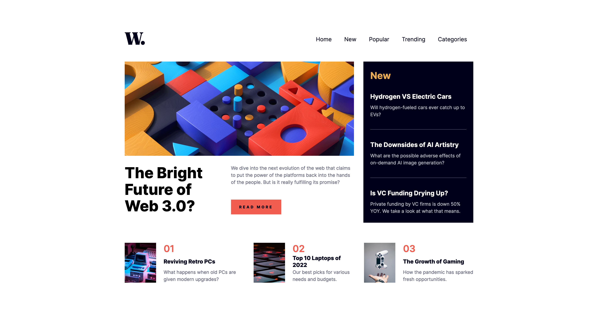

# News Homepage

My solution to the [News Homepage Challenge on Frontend Mentor](https://www.frontendmentor.io/challenges/news-homepage-H6SWTa1MFl).

Users should be able to:

- View the optimal layout for the interface depending on their device's screen size
- See hover and focus states for all interactive elements on the page

## Screenshot

## Links

- [Source](https://github.com/mothy-08/fm-news-homepage)
- [Live](https://mothy-08.github.io/fm-news-homepage/)

## Built with

- HTML
- CSS
- JS
